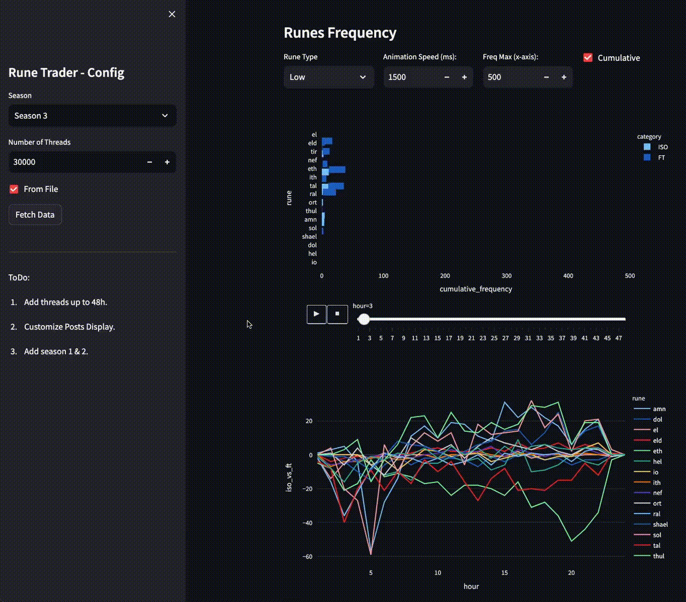

# D2R JSP - Season Arbitrage Helper

A small scraper to fetch data from [d2jsp.org](d2jsp.org), a trading website for Diablo II. The idea was to discover arbitraging opportunities early on after a ladder reset. What Runes are in demand, what is selling at what time. The objective is to then use such insight to maximize my flash farming during the first hours of a ladder reset. (#TotalNerd)

See [video](https://www.youtube.com/watch?v=b4u6R3uE7eI) in action.